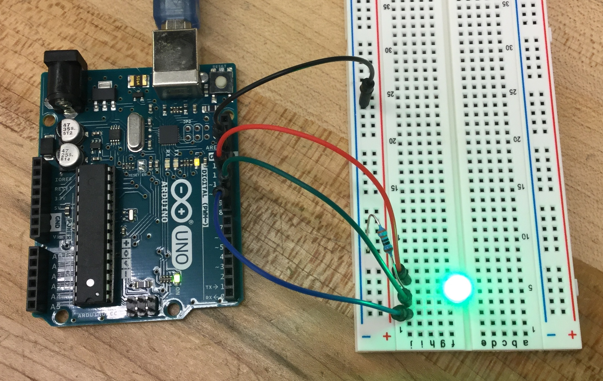
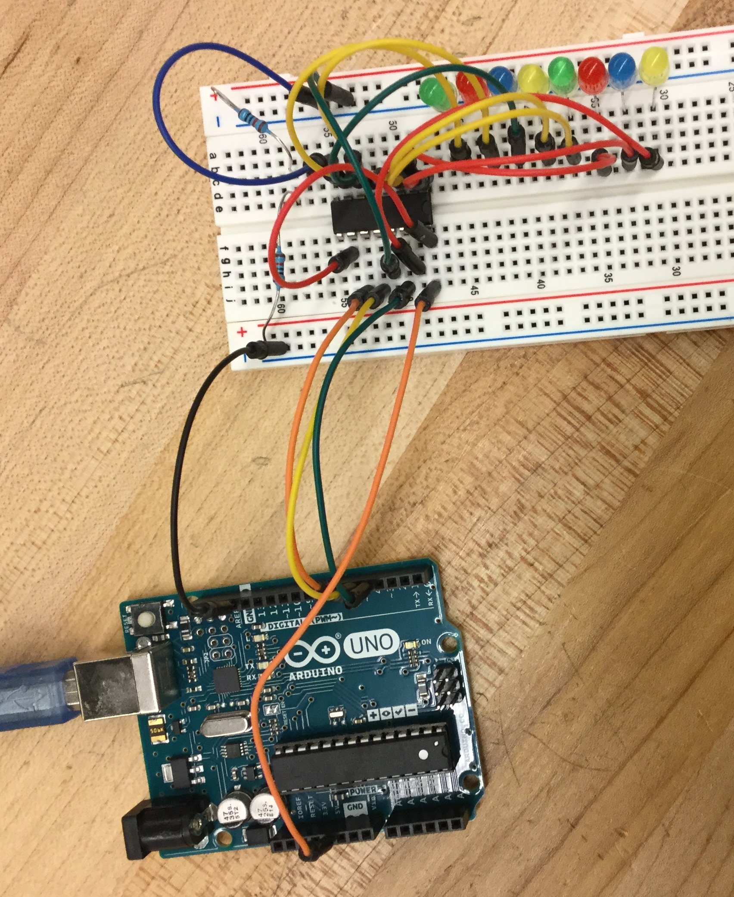
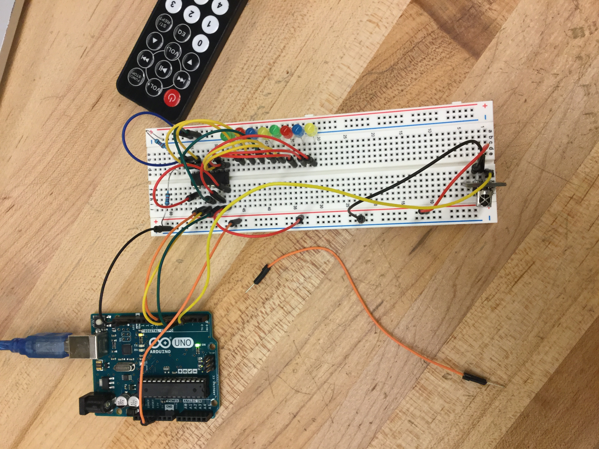

# Sept 15: Arduino Assignments: RGB LED and shift register

I worked through lessons 3 and 4 of the Adafruit Arduino tutorial. 

## RGB LED (Lesson 3)

Lesson 3 covered the RGB LED, which I already had some experience with.

One thing I found peculiar about Adafruit's design was that they had a resistor on the R, G, and B LEDs. ([Their circuit.](https://cdn-learn.adafruit.com/assets/assets/000/002/083/original/learn_arduino_project_3_on_breadboard.jpg?1396779133)) This is unnecessary, since you can just put a single resistor on the ground LED. This is how I did it:

**Resources:**

- Adafruit lesson 3: ([link](https://learn.adafruit.com/adafruit-arduino-lesson-3-rgb-leds/overview?view=all))
- Working video: `assets/rgb_video.mov`
- Code: `code/rgbled`

## Shift Register (Lesson 4)

Lesson 4 covered the shift register, which I had never used before.

I noticed the same issue with Adafruit's design as before. Instead of using 8 resistors for 8 LEDs, you could just ground them all to one resistor. ([Their circuit.](https://cdn-learn.adafruit.com/assets/assets/000/002/101/original/learn_arduino_breadboard.jpg?1396779268)) I actually used 2 resistors because I was afraid that one wouldn't be enough, and I didn't want to burn out 8 LEDs at once. Here's my circuit:

**Resources:**

- Adafruit lesson 4: ([link](https://learn.adafruit.com/adafruit-arduino-lesson-4-eight-leds))
- Working video: `assets/shift_video.mov`
- Code: `code/shift`

## Going Further (IR Remote Demo)

I wanted to add some extra functionality to apply my new knowledge of the shift register. The first thing I noticed was that 8 bits could represent any byte. The most obvious representation would be a number. (Any number 0-255 can be represented by 8 bits.) So, I set out to build a calculator. A standard IR remote comes with digits 0-9 in addition to a bunch of buttons.

First, to test the IR, I ran an IR dump program. This would dump any values sent by the remote. I used this program to find out the corresponding IR values for each of the buttons on the remote.

Next, to try to get the register to display any number, I started out by having the value displayed by the register increment by 1 every interval. The, to test these two working together, I added the ability to use rewind/pause/fast forward buttons to select 3 speeds of counting. Here's the circuit I used. The shift register part is untouched; I only added the IR component.

At this point, I ran out of time, and thus never got to finish my calculator. However, that would just be a matter of code, as both the IR and shift work just fine.

**Resources:**

- Adafruit IR guide: ([link](https://learn.adafruit.com/using-an-infrared-library/hardware-needed))
- IR dump video: `assets/irtest_video.mov`
- IR dump code: `code/irtest`
- Counter video: `assets/remoteshfit_video.mov`
- Counter code: `code/shift2`