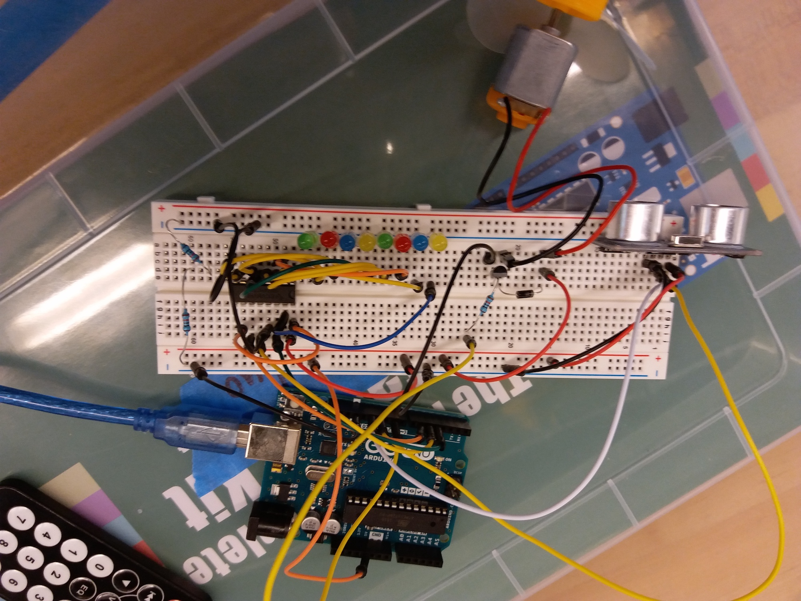

# Sept 20: Convolution (Also a motor)

I was supposed to continue following through the Adafruit lessons. However, for whatever reason, I was unable to find my robotics kit. It just wasn't in the lab. However, I did not let this deter me from my work. I ended up writing a webpage to demonstrate 1D convolution.

## Motor

I followed Adafruit lesson 13 to use a DC motor. It was pretty straightforward. Here's my circuit:

**Resources**

- [Adafruit lesson 13](https://learn.adafruit.com/adafruit-arduino-lesson-13-dc-motors/)
- Working video: `assets/motor_video.mp4`
- Working code: `code/motor`

## Moving Average

If you check the final video (playing music) from the last entry, you'll notice that the ultrasonic can be inconsistent. For a variety of reasons, the sensor will often send garbage data, whether from poor reflection or from physical interference like a fly passing through.

In theory, one can mediate this by using the average of the last n inputs. For instance, you could average the last five inputs, meaning that sudden variations would be weighted by the previous four inputs, making the signal more consistent. The downside is that the signal will lag by four inputs. For instance, if the sensor operates at 50 ms breaks, if an object truly is placed in front of the sensor, it will take 5*5 = 250 ms to fully register the new position of the object.

We can understand this feeding all the data through a 5-long data "window." The window moves with the new data, hence the name "moving average."

This is demonstrated in the video below, where, for demonstration purposes, there is a visible lag in the logging of the ultrasonic.

- Working video: `assets/movingaverage_video.mp4`
- Working code: `code/movingaverage`

**Resources:**

None, I wrote all the code myself.

## Going Further (Convolution Simulation)

Technically, the moving average is a subcase of a more general concept in image processing called convolution. I won't go into specifics here, but [this page](https://docs.gimp.org/en/plug-in-convmatrix.html) gives a good introduction. In theory, a stream of data from a sensor is basically a 1D image, meaning that any image processing filter can be done using the same window from the moving average. 

Understanding the problem this way opens up much more functionality with the moving average. For instance, we could use a 1D edge detection filter, which would essentially be the equivalent of a low pass.

I wrote a webpage to demonstrate convolution. It's found at `code/convolution`.

**Resources:**

- [GIMP docs on convolution](https://docs.gimp.org/en/plug-in-convmatrix.html)
- [Working webpage](): `code/convolution`