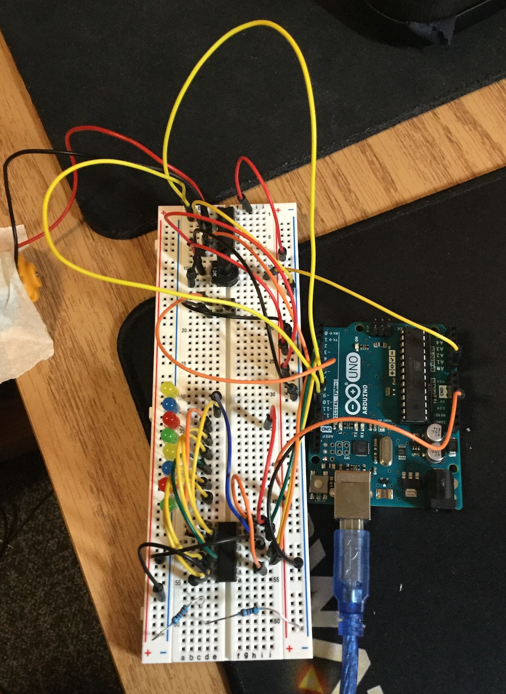
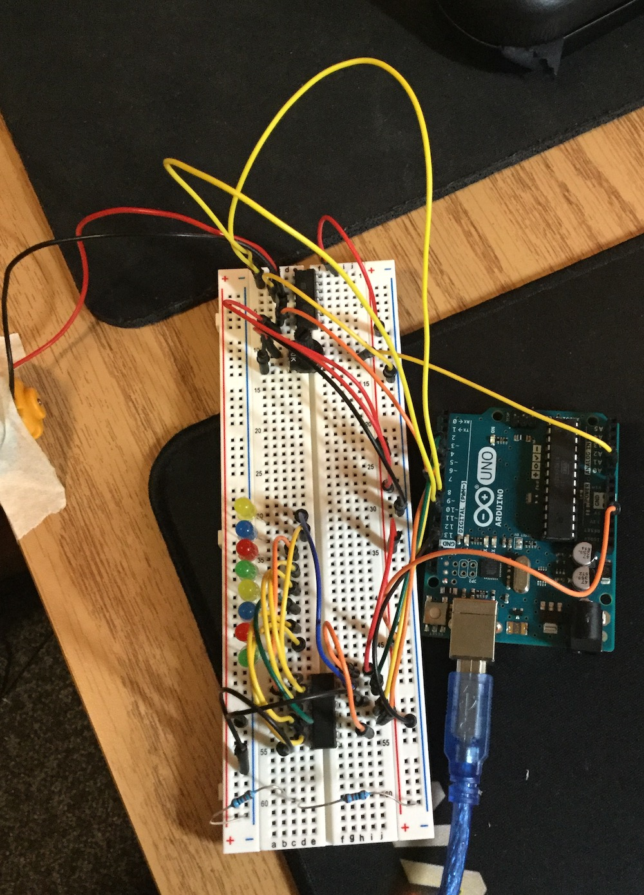

# Sept 22: H-Bridge and Motor Reversal

I did Lesson 15 of the Adafruit Arduino lessons.

## H-Bridge

I followed Adafruit's lesson 15 covers using an H-bridge to reverse a motor's direction. At first, the motor didn't run, and I thought I had run into an issue somewhere with either the circuit or the code. However, I realized that the issue was just that the motor was very weak, and could be easily stopped with even a light touch. To mitigate this for testing, I taped the motor down my table. This also made filming easier.

My working circuit:

**Resources**

- [Adafruit lesson 15](https://learn.adafruit.com/adafruit-arduino-lesson-15-dc-motor-reversing/arduino-code)
- Working video: `assets/hbridge_video.mov`
- Working code: `code/hbridge`

## Going Further (Using the Shift Register)

I noticed that the interface of using both the button and the 10k pot to control the motor was quite clunky. I figured I could streamline it by using the middle value of the pot as a "motor zero," with greater values turning the motor one direction and smaller values turning the motor the other direction.

I also thought it'd be cool to use the shift register as a way of visually tracking the position of the pot. This was a relatively simple task.

The main issue I ran into when testing this project was that the shift register would occasionally light up all 8 LEDs at once. I'm not exactly sure why this happens, but it seems to have to do with how hard I hold the pot when I turn it. I'm guessing that it's just a matter of weak jumpers and sloppy wiring. It's also possible that my hand is grounding something.

Here's my working circuit. The only difference is the removal of the push button.

**Resources:**

- Working video: `assets/hbridge2_video.mov`
- Working code: `code/hbridge2`