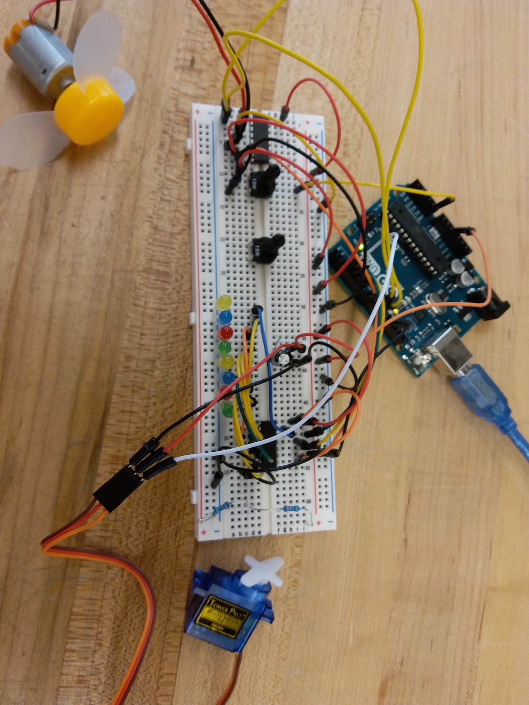
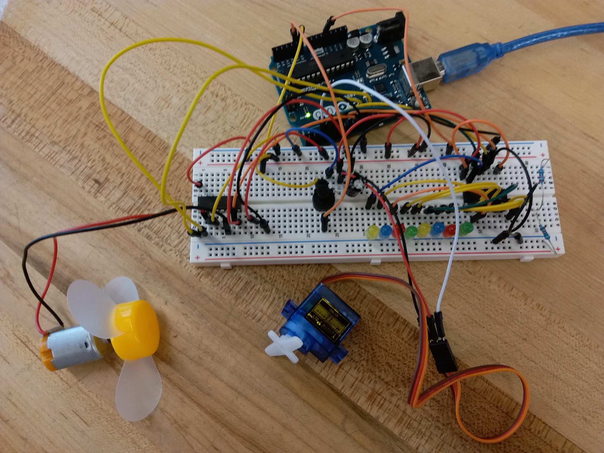
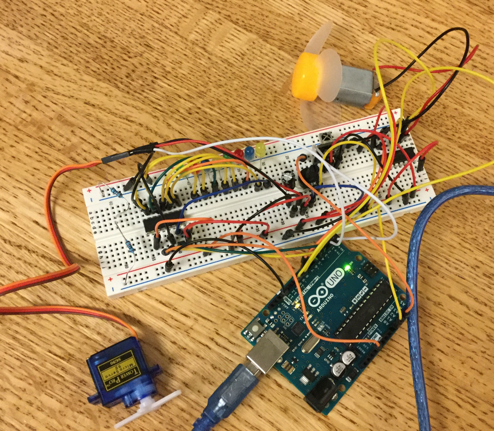

# Sept 25: Servo Motor

I did Lesson 14 of the Adafruit Arduino lessons, which covered servo motors. I had never used servo motors before.

## Servo Motors (Part 1)

Adafruit's lesson 14 covers the use of a servo motor. There are two builds. The first is called "sweep", and just introduces the servo motor by having it sweep back and forth. It's pretty straightforward, and I had no trouble constructing it.

My working circuit:

**Resources**

- [Adafruit lesson 14](https://learn.adafruit.com/adafruit-arduino-lesson-14-servo-motors)
- Working video: `assets/sweep_video.mp4`
- Working code: `code/sweep`

## Servo Motors (Part 2)

The other build that Adafruit covered was called "knob", where a potentiometer is used to control the position of the servo. I ran into some trouble following the tutorial, where the servo would just keep moving without stoping. The issue ended up being with the potentiometer. I was using a potentiometer from a really cheap kit with low-quality parts. I ended up switching the potentiometer with the other one, which I knew worked (also pictured on the board) and the issue was fixed. I think the potentiometer was poorly constructed and just closed the circuit without resistance.

My working circuit:

**Resources**

- Working video: `assets/knob_video.mp4`
- Working code: `code/knob`

## Going Further (Making a Door Lock)

For this project, I wanted to make something that could actually be converted into something useful. Servos can be used to create precise mechanical transductions, and are often easily programmable. This makes the project easily extensible to a real door (rather than a toy servo) provided access to the right materials.

I used an IR remote to input a four-number combination. The working video demonstrates the combination "1234", but this is easily reprogrammable. When the correct combination is entered, the servo position is set to 170. From here, once any number is pressed, the position is set to 0 until the correct combination is entered again.

One issue I ran into during development was that the servo would keep moving indefinitely when calling `servo.write(170)`. I'm not really sure why this happens, but my prediction is that the servo goes just past 170, then loops all the way around to reach 170 again, and so on. I'm not really sure how to resolve this, since I just copied code from the "knob" example.

I used the shift register to provide visual feedback of the last number pressed. IR can be a little finicky, and numbers occasionally don't go through. The shift register will flash with the number pressed (in binary) when a valid IR signal is processed.

Here's my working circuit:

**Resources**

- Working video: `assets/lock_video.mov`
- Working code: `code/lock`
