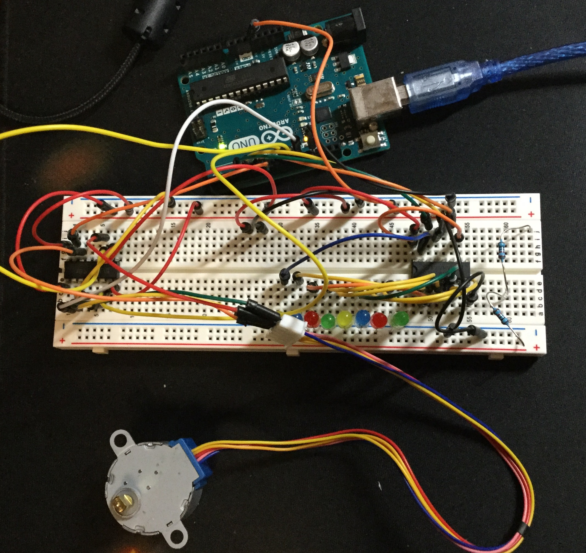
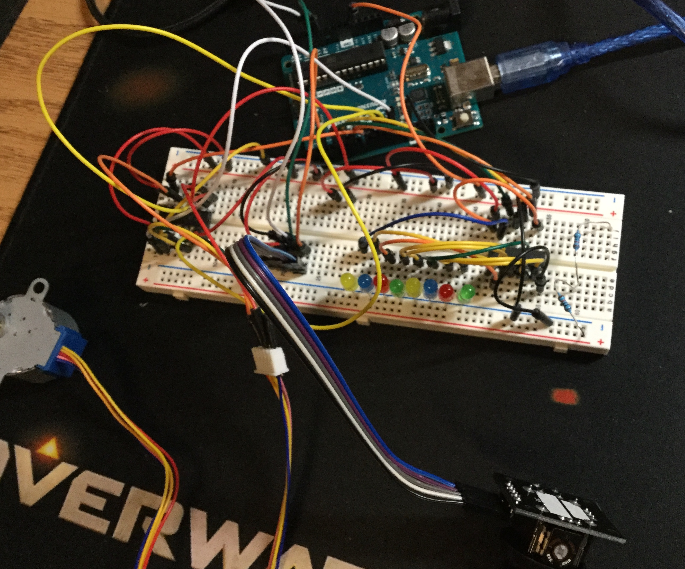

# Sept 27: Stepper Motor

I did Lesson 16 of the Adafruit Arduino lessons, which covered stepper motors. I had never used stepper motors before.

## Stepper

Adafruit's lesson 16 covers the use of a stepper motor. I didn't run into any trouble constructing this circuit.

My working circuit:

(Note on the video: the first few seconds got lost, but I inputted '400' to the Serial monitor the first time. This is just to show the stepper going opposite directions.)

**Resources**

- [Adafruit lesson 16](https://learn.adafruit.com/adafruit-arduino-lesson-16-stepper-motors/)
- Working video: `assets/stepper_video.mov`
- Working code: `code/stepper`

## Going Further (Joystick)

When I was thinking of ways to make the stepper cooler, the first thing that came to mind was a Joystick. I imagined using a joystick to control the speed and position of the stepper. However, once I realized that the joystick module also had a click button, I wanted to find a way to integrate this feature, as well.

I ended up using the joystick movement to control just the speed of the stepper. Since I had 8 lights on the shift for visual feedback, I use 4 for each axis, thus creating a base-4 number system. The y-axis of the joystick controls the 4s place, while the x-axis controls the 1s place. Clicking down on the joystick causes the motor to move 500 steps at the speed set by the joystick.

The main reason I didn't use one axis to control speed and the other to control step amount is that every now and then, I would run into an issue where the program would just freeze. This seems to happen when I enter either motor speeds or step values that are too high or too low. I think that the Arduino stepper library probably waits for a response of some sort from the motor, and stalls the thread until it gets one, thus making bad inputs result in a program crash. There are a few instances where the motor doesn't move at all (but doesn't crash the program) in the working video.

My working circuit:

In the working video, the speed is a little bit wonky. It's supposed to just go up or go down as the lights go to one side, but that does not seem to be the case at all. As mentioned earlier, I think the program messes up if the speed input is too high or too low. I will have to tune the speed calculation a little bit. There also might be an aspect of physical resistance. I think that speed might not be the best indicator of value; perhaps I should use step amount instead. However, I ran into similar issues when I tried to modulate step amount, where the program would sometimes crash.

Currently, I'm using the following speed calculation:

`motor.setSpeed(4*(4*(posY)+posX)+10);`

`posY` and `posX` are ints from 0-3 representing the current position of the two variables. The above calculation is a little bit wonky. I'm basically using `posX` as a finer control than `posY`. It matches up in base 16 so that `posY=2, posX=0` is more than as `posY=1, posX=3`. I also add 10 to make sure that a 0 speed can't be sent, since I was having trouble with that before.

**Resources**

- [Arduino Joystick Module Example](http://42bots.com/tutorials/arduino-joystick-module-example/)
- Working video: `assets/lock_video.mov`
- Working code: `code/lock`
