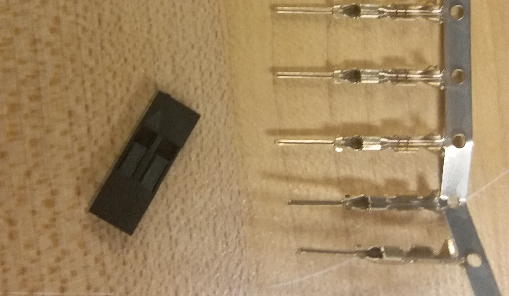

# Oct 06: Motor Assessment

In class on Oct 06, I was given a broken motor to fix. Here's what it looked like when it was given to me:

I identified two obvious issue based on what I saw:

- One of the pins at the end of the wire is broken
- The wire is broken at two places

In order to ensure that there were no other issues, I connected 3.3V and GND from an Arduino directly to the remaining bits of red and black wire on the motor box. The motor moved correctly, indicating that the issue was exclusively with the wiring.

Initially, I tried just soldering the two broken joints back together. However, I realized that all the flex and strain placed on these joints would pull the solder apart. There also wasn't enough space to crimp the wire. I decided that the easiest way to resolve this was probably to resolder the wire from its source with a longer wire.

I disassembled the motor using a small phillips head screwdriver. 

Here's what the front side looks like. 

You can see two gears that connect the front side and the back side. There are also two screws that attach the motor to the motor case. Here's what the back side looks like:

You can see that the top gear has a hole for a square shaft. At the bottom, you can see the DC motor that powers the whole thing, attached to a controller board. Here's what the motor board looks like.

Here's the fully disassembled motor box.

The next step was to change the wires on the motor board.

You can see a capacitor, which is attached to the voltage (red) wire. (Technically, it doesn't matter since the motor can run either direction, but for consistency we maintain wire colors.) The capacitor is presumably to maintain a steady power to keep the motor running at a constant speed.

I resoldered a red and black wire onto the board, then tested it on an arduino. A video of the motor working is shown in `assets/working_motor.mp4`.

The next step was to reattach the cylinder on the wire. The cylinder serves to remove some of the strain and torque from moving the wire. Here's what it looks like by itself.

Here's what it looks like with the heat shrink removed.

I simply my wire through to reattach it. Since I couldn't find any heat shrink or electric tape, I just used a zip tie.

The final step was to reattach the pins. The pin heads, when disassembled, look like this.

Each pin on the right can go through one of the holes on the left. Here's what a soldered pin looks like.

I was easily able to solder and insert new pins. Here's the completed pin head.

The only thing remaining thing I had to do was to attach the wire and make sure it didn't split. I used zip ties to do this.

Finally, all I had to do was test the full thing, to make sure that the pin connections were solid. The working video is found in `assets/working_motor.mp4`.