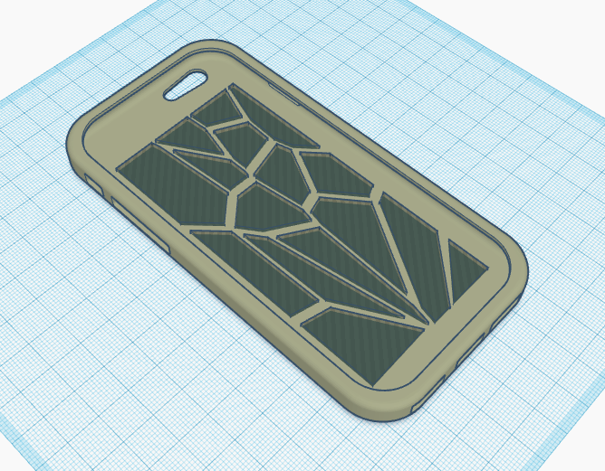

# Oct 09: 3D Printed Phone Case

My next task was to get familiar with simple CAD software and 3D print an object.

I decided to make a phone case. I downloaded an iPhone 6 case model from [Thingiverse](https://www.thingiverse.com/thing:607772), then imported it into [TinkerCAD](https://www.tinkercad.com/).

My goal was to make a simple but cool print. I managed to find a Voronoi shape generator on TinkerCAD. I used it to create Voronoi holes in the back of the case. The generator allows multiple parameters to be tuned. I decided to use 16 cells with a cell size of 19.74 and a spacing of 0.78. I tried to select these parameters to create dense enough patterns such that they're interesting, while leaving enough space for the structural integrity of the print to not be compromised.

I downloaded my model from TinkerCAD and used Cura to slice it to an Ultimaker 2 Extended+.

I left my print overnight. Unfortunately, when I came back the next morning, it had disappeared. I'm assuming the printer messed up somewhere and the print was discarded. However, I noticed that the printer I had used didn't have properly working fans. I wonder if this contributed to the print messing up, since this would lead the filament to not cool properly. Particularly on a thin print like this one, this may have led to curling on the edges of the print.

