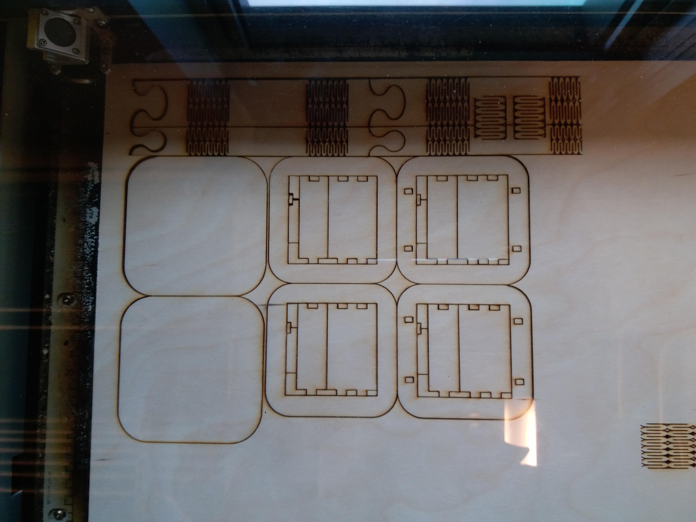
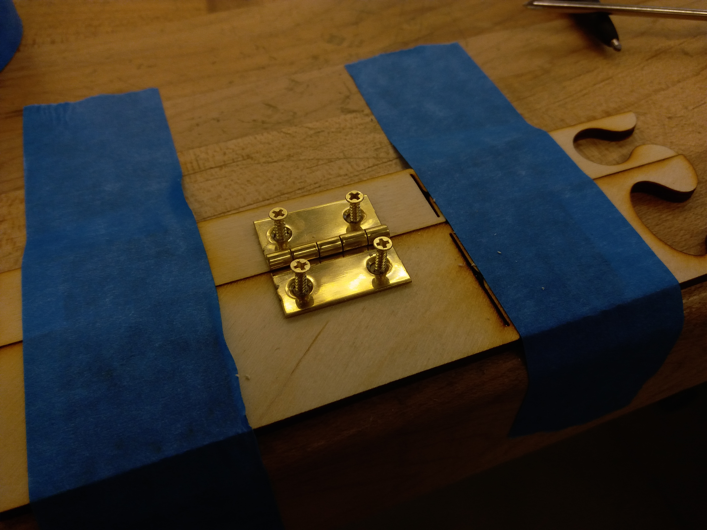
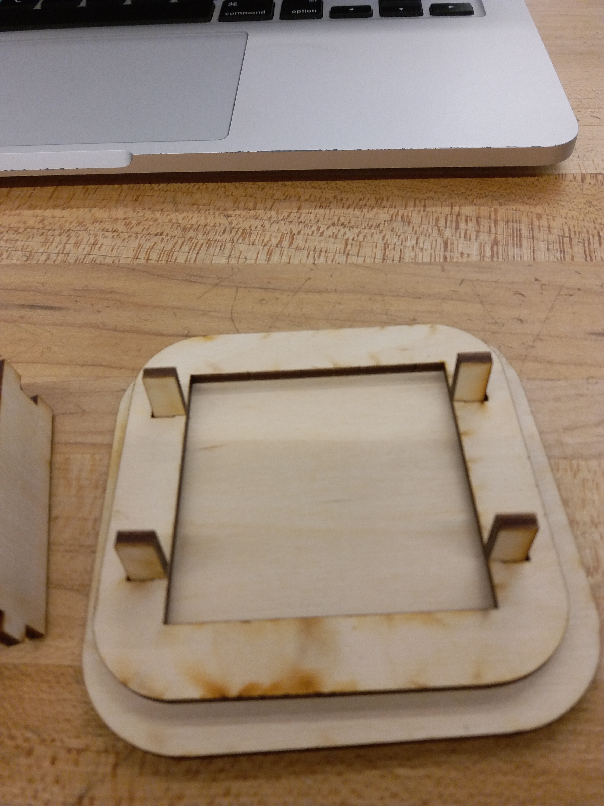
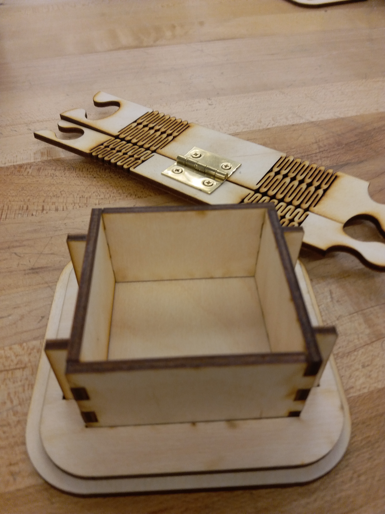
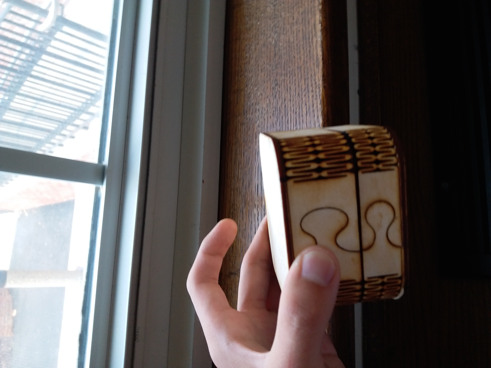

# Oct 11: Laser Cut Jewelry Box

My next assignment was to make some sort of a 3D build using laser cut parts. I decided to make a Jewelry box based on [this design](https://www.thingiverse.com/thing:93130).

I used a laser cutter to make these pieces. Here's a picture of the laser cutter in action:

Here's what all the parts look like:

By this point, I wasn't sure if I wanted to use the living hinge or a mechanical hinge. I ended up deciding to go the mechanical route. This meant I had to install a latch. Here's what it looked like:

Next was assembly. The design is fairly straightforward - there's an inner box and an outer one. They're attached by these little nub pieces.

To attach the other things, I basically used wood glue and clamped the heck out of it.

Here's what the final product looked like:

During the process, I also installed magnets on the inside so that the box would latch close. Here's a picture of the box being held upside down:

## Final Thoughts

If I were to do this project again, I'd find a way to create a mechanical lock, since the magnets were quite weak (and also very difficult to install.)