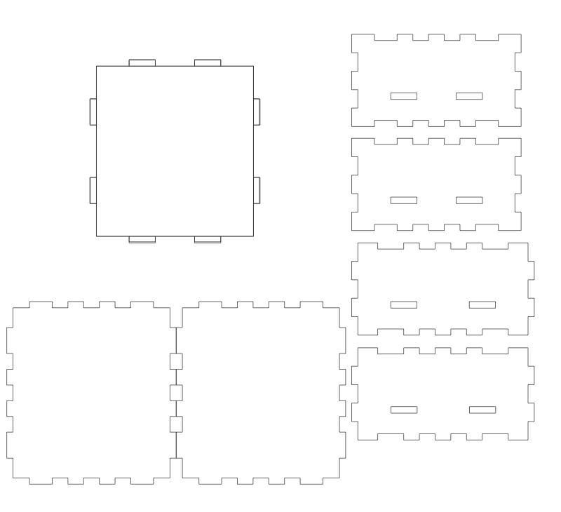

# Designing a Case

While I was waiting for parts to come in, I decided to work on whatever else I could. Considering that half the point of the build is to leave it outside, I would need to design a case. I made some measurements, and planned to make a 2-layer case where I could place the Arduino on top of the batteries.

It looks like this:

You'll find the file at `/final_project/assets/case.ai`.