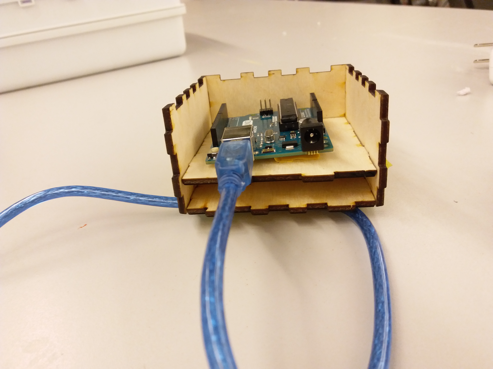

# Case Assembly

I still had to test two more parts on the soldered board, the transistor and the servo. Both worked well.

- transistor video: `/final_project/img/assembly_transistor.mp4`
- servo video: `/final_project/img/assembly_servo.mp4`

Finally, I laser cut and assembled the circuit into the case.

In the last photo, you'll noticed that I drilled out a number of nubs to fit the wires through. This wasn't an oversight in the case file; I had originally planned to use a drill because I wasn't sure how large I'd need each hole to be. However, the wires ended up being thin enough that this wasn't an issue. Next time, I'll put the holes fire the wires directly in the case file.