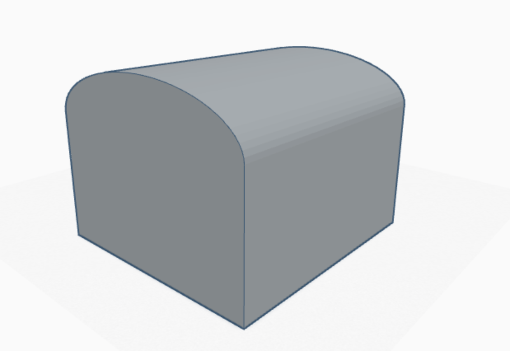
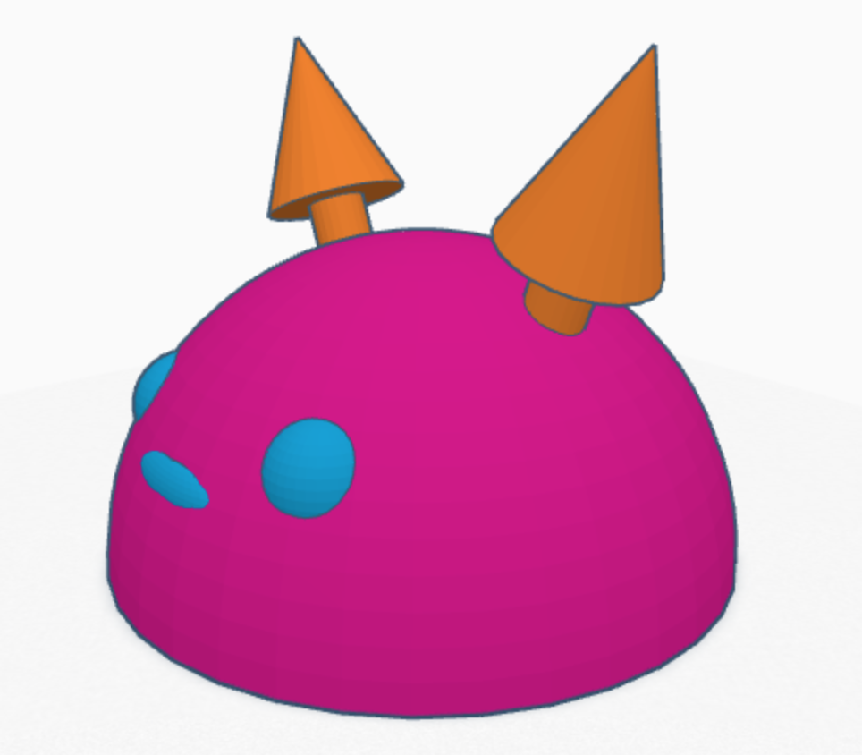

# 3D Printed Cover

I was initially planning to make a totoro stand with movable arms and have it pick the housing up and place it down. However, I soon realized that laser cutting a 3D figure be jarringly unrealistic, and would remove the cutenes factor, which was half the point of using Totoro in the first place.

It didn't help that the housing print I tried, which I made in Tinkercad, had already failed:

(file is found at `/final_project/assets/housing.stl`)

Instead, I tried to make a Totoro hat, which would swing over the controller in the final project. I haven't checked on this print yet, so I don't know if it worked.

(file is found at `/final_project/assets/totoro_hat.stl`)

I also soldered the transistor/motor circuit, an on switch, and the batteries.

--TODO ADD PHOTOS--