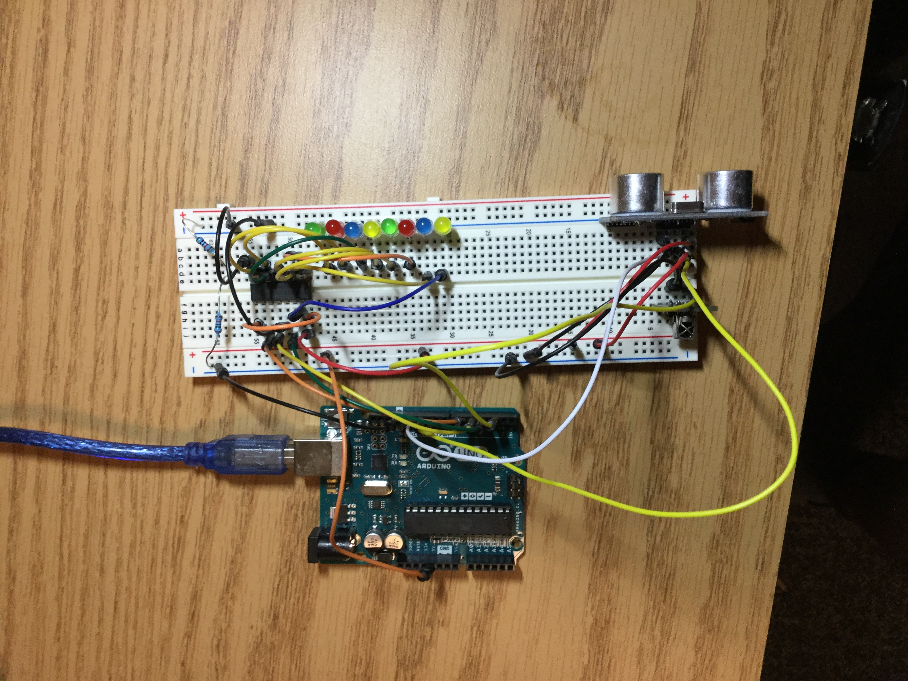

# Sept 18: Arduino Assignments: Using a New Sensor

Since I had already done many of the Adafruit lessons, I was supposed to learn how to use a sensor that I hadn't used before. I decided to use an ultrasonic sensor.

## Ultrasonic Sensor

I used [this](http://randomnerdtutorials.com/complete-guide-for-ultrasonic-sensor-hc-sr04/) guide to wire and test my ultrasonic.

The given sample code worked just fine, and was correctly dumping distances. The next step was to make it do something cooler. The first thing I thought of was a [theremin](https://www.youtube.com/watch?v=Nsorb_tyeEE), so I decided to interface with [Pure Data](https://puredata.info/). I had trouble with interfacing through Serial communication before, but I managed to figure it out.

This [guide](http://fabacademy.org/archives/content/tutorials/12_Interface_and_Application_Programming/PD_to_Arduino_Over_Serial.html) helped me figure out serial communication. The issue I had in the past was that I was using `Serial.println` instead of `Serial.write`, so PD was picking up `EOF` characters.

Here's what my final circuit looked like. The breadboard still has the shift register, I just added an ultrasonic.

**Resources:**

- Complete Guide for Ultrasonic Sensor HC-SR04 ([link](http://randomnerdtutorials.com/complete-guide-for-ultrasonic-sensor-hc-sr04/))
- Pure Data to Arduino Over Serial ([link](http://fabacademy.org/archives/content/tutorials/12_Interface_and_Application_Programming/PD_to_Arduino_Over_Serial.html))
- Serial test code: `code/serialtest`
- Ultrasonic test code: `code/ultrasonictest`

## Going Further (A Mini Music Instrument)

I decided to challenge myself to interface two sensors at once through serial. I had never done this before. The trouble is that serial communication only gives you a single stream of data, thus making receiving and distinguishing between two different values very difficult.

I managed to get it to work by using bytes 254 and 253 as 'trigger' bits. These bits would not occur naturally, as they are very high. (I don't use 255 because that sometimes gets sent for overflow, such as when the ultrasonic sensor screws up.) A byte of 254 through serial means that the next byte is ultrasonic, while 253 means the next byte is IR. Then, on the PD side I could break up and interpret this data stream.

I later used the aid of my piano to try to create some blues music with this system. The video is given below.

**Resources:**

- Working code: `code/instrument`
- Testing the system: `assets/instrument_test.mov`
- Making some 'music': `assets/instrument_music.mov`